# Stele 🗿

A personal journal, and the notes you want to keep next to it.

Stele is my own take on keeping a diary. It came out of a habit I already had — writing the day and pulling out the top five small wins and highlights — and it is that habit made queryable. It works fully offline, stores everything in SQLite on the device, and exports the whole archive to JSON.

<p align="center">
  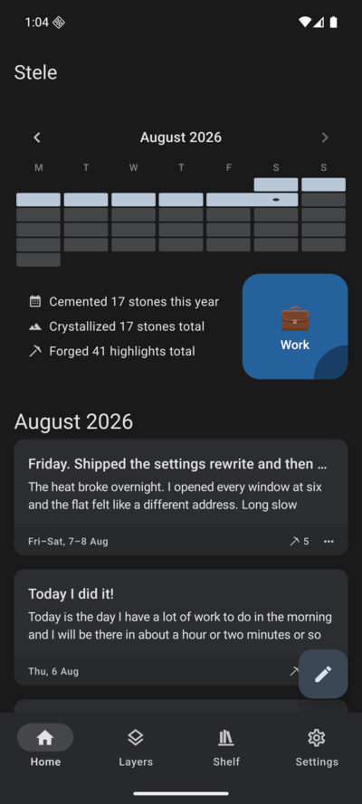
</p>

The product spec is [`docs/PRD.md`](docs/PRD.md).

| Write the day                              | See the month                               | Read it back                                   | Zoom out                                         |
| ------------------------------------------ | ------------------------------------------- | ---------------------------------------------- | ------------------------------------------------ |
| 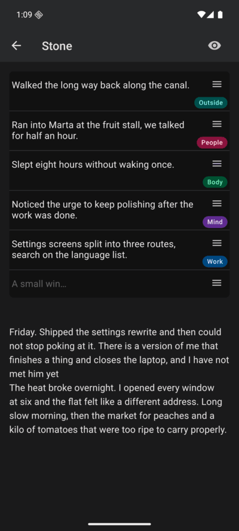  | 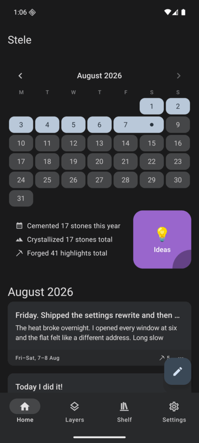 | 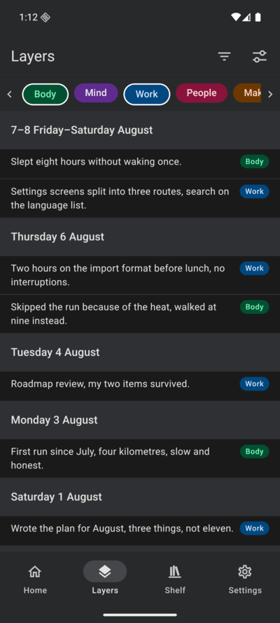 | 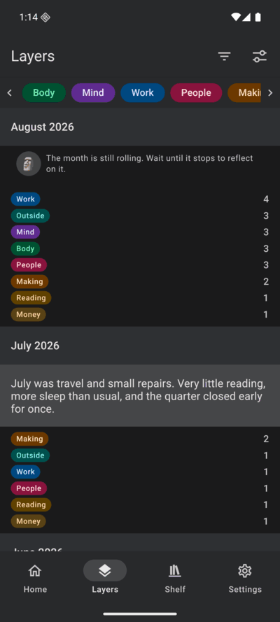 |
| the body, and the highlights struck off it | one cell per day, a range shown as one pill | every highlight ever, filtered to two tags     | the month as tag counts, with its reflection     |

## How it works

1. You write a **journal note** for the day: free-form Markdown, at whatever length you feel like.
2. You pull out of it a handful of **highlights** — small wins, things learned, things that happened. Each one can carry tags you create (`math`, `cs`, `new`).
3. The highlights leave the day and flow into one continuous log you can read end to end, filter by tag, and drill back through into the day they came from.

As weeks and months pass, **reflections** unlock: a short free-text summary of the week, then of the month, then of the year. A period that is still running cannot hold one — the app says the week is still rolling and asks you to wait until it stops. Zoomed out, the log stops listing highlights and becomes counts per tag, with the reflection written above them: the same record at lower resolution, the way a progressive JPEG shows the picture before the detail arrives.

<details>
<summary>More screens</summary>

|                                                 |                                              |                                                |
| ----------------------------------------------- | -------------------------------------------- | ---------------------------------------------- |
| 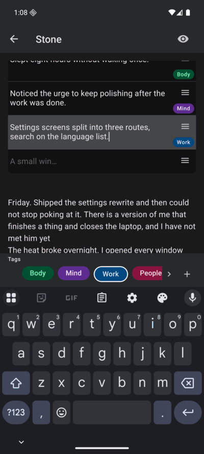        | 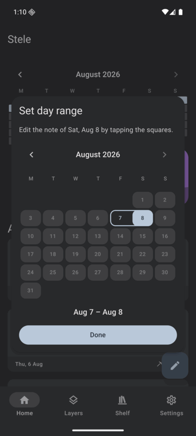    | 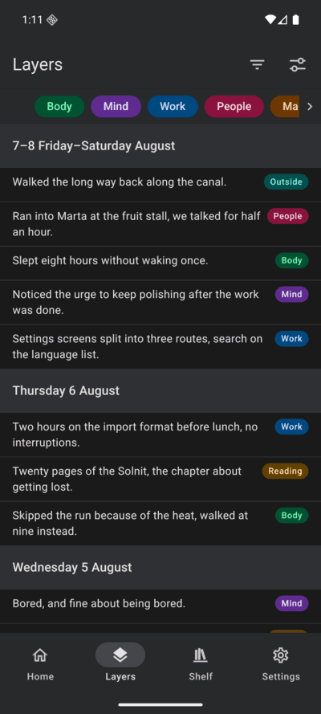 |
| tagging a highlight                             | ranging one note over several days           | the log, unfiltered                            |
| 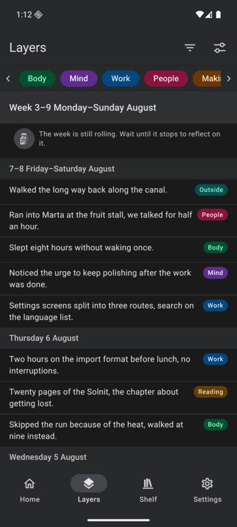 | 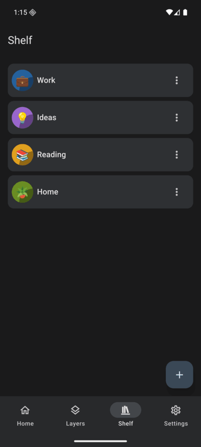    | 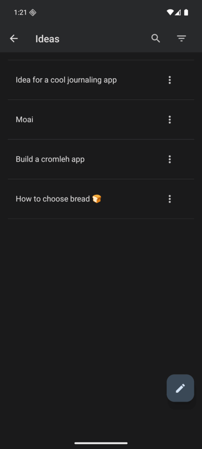     |
| the same log by week                            | the shelf                                    | one tablet open                                |
| 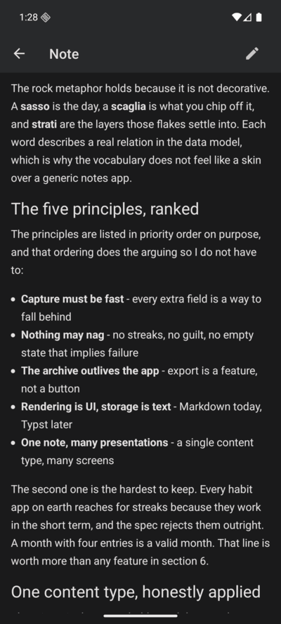       | 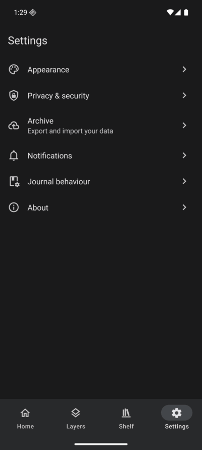 | 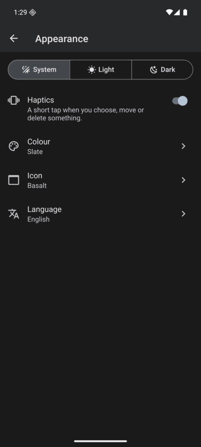 |
| a note, Markdown rendered                       | settings                                     | appearance                                     |
| 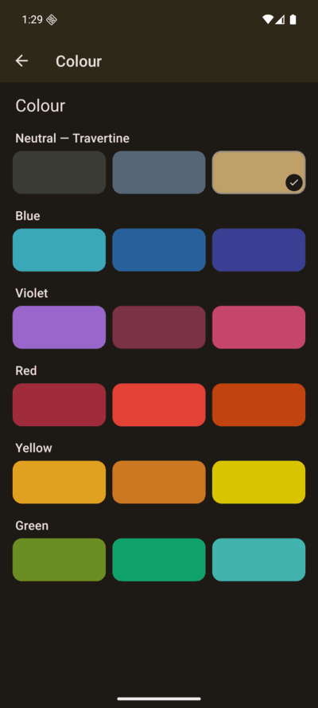     | 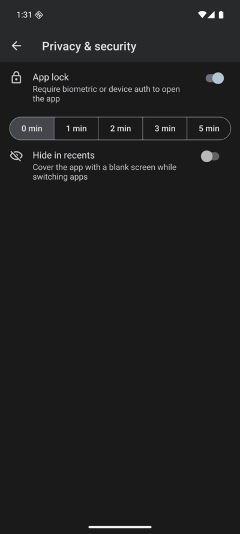  | 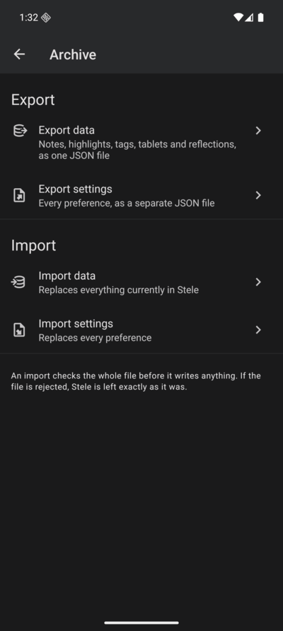    |
| the accent stones                               | app lock                                     | export and import                              |
| 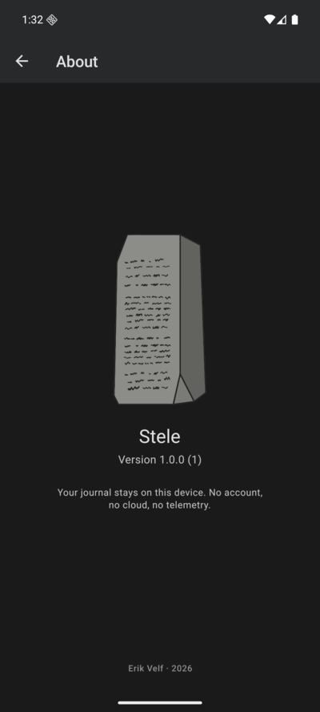       |                                              |                                                |
| about                                           |                                              |                                                |

</details>

## Where it came from

I was already journaling, in [Joplin](https://joplinapp.org) — a plain open-source note app — to process the day and reprogram how I wanted to head into the next one. Every entry was the same template, four prompts:

- the top five highlights and small wins of the day
- a description of the day
- conclusions
- what I learnt today

It worked, and it stayed a pile of documents. The five highlights were the part I most wanted to read back months later, and the part a note app could do least with: no way to ask what happened with a subject, no way to put a year of small wins in one column. So the template became the app, and a highlight became a thing of its own instead of a bullet inside a file.

Ranges came out of the same notebook. Some days felt like several and were genuinely one long stretch; on others I procrastinated, took nothing but a highlight or two, and simply let the day keep running rather than open a new entry for it. On paper you do that by not drawing the line. Here a note covers 6 to 8 August and the app keeps the accounting straight.

The notes on the shelf come from the same habit. Whenever I drifted off my plan — not following the day I had laid out — I would write a different kind of entry: a look back at the week and a decision about what to change next, a PID controller nudging the course back. Those, and ideas, and the bucket list, are not the record of a day; they are the things you want within arm's reach. In a flat note app they sank into the pile with everything else. Here they sit beside the journal instead of inside it.

None of it is invented, then. Every part of the app is a habit I already had, standardised — the template, the five highlights, the days that ran long, the off-plan course correction — with the one thing paper could not give me added on top: the ability to ask the archive a question.

Text and nothing else, deliberately. No photos, no attachments, no voice notes. Text is enough to write a day, and your gallery already holds every picture you would attach — the journal does not need to become a second, worse copy of it.

The name arrived on the subway. I was on my way to the park, dressed head to toe in light grey, monochrome, and it occurred to me that I looked like a rock. Everything in the app is named from there.

## The rock vocabulary

A **stele** is a standing stone with a record cut into it — the thing people used when they wanted writing to outlast them. The whole app is named after that, and everything inside it is named out of the same quarry.

| In the app   | Italian  | What it is                                                                                                                     |
| ------------ | -------- | ------------------------------------------------------------------------------------------------------------------------------ |
| **Stone**    | Sasso    | one journal note — a day, and the highlights struck off it                                                                     |
| **Flake**    | Scaglia  | one highlight. A chip knocked off a stone                                                                                      |
| **Layers**   | Strati   | every flake ever, stacked in order, read top to bottom                                                                         |
| **Basket**   | Gerla    | the week — a load of stones carried together                                                                                   |
| **Marker**   | Cippo    | the month. A _cippo miliario_ is the Roman milestone, the carved stone set every mile to tell travellers how far they had come |
| **Mountain** | Montagna | the year — the stones and their markers, piled up                                                                              |
| **Tablet**   | Tavola   | a folder of notes, after _le Dodici Tavole_                                                                                    |
| **Shelf**    | Scaffale | the page holding your tablets                                                                                                  |

The accent colours are stones too — basalt, slate, travertine, lapis lazuli, porphyry, malachite, cinnabar, amber, and eleven more, all read against the grey.

The app icon is one of them too, and switching the accent does not switch the icon — they are chosen separately.

<p align="center">
  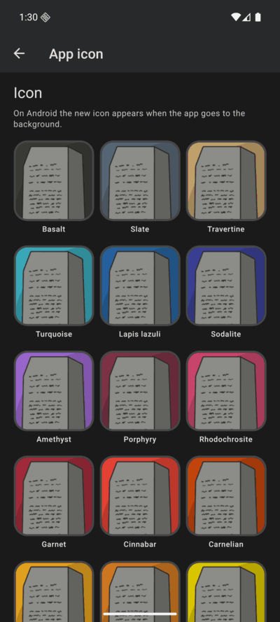
</p>

## What it does

- **Multi-day notes** — sometimes a day continues. A note can cover a range, 6 to 8 August, when that stretch is genuinely one thing. Ranges are exclusive, so two notes never cover the same day.
- **Highlights** — small shards of the day, taggable, so progress on a subject scattered across dozens of non-adjacent days becomes visible.
- **Reflections** — optional summaries at week, month and year level.
- **Stats** — basic for now, and the part most likely to grow.
- **Shelf and folders** — folders of ordinary notes with Markdown: bucket list, things to buy, things to improve. Not todos — the things you meant to do, sitting beside what you actually did.
- **Export and import** — notes, highlights, tags, tablets and reflections as one JSON file, and every preference as a second one. Complete enough to rebuild from nothing, simple enough to edit by hand. An import checks the whole file before it writes anything, so a rejected file leaves the app exactly as it was.
- **Appearance** — Italian and English, theme, accent colour, haptics, alternate app icons.
- **Local authentication** — device biometrics or passcode to open the journal, with a grace period of up to five minutes, and an option to blank the app in the recents switcher.
- **Reminders** — a local notification when you want a nudge to write.
- **Templates** — prefill new journal notes so you never start from a blank screen.

## Not built yet

Things I want, in no particular order. They move up into the list above when they ship.

- **Surfacing the past** — a stone from a year ago, or a month ago, brought back to the home page. The _macigno_ roulette in the PRD: the archive reminding you of itself instead of waiting to be searched.
- **A year wrapped** — the year read back as one screen. Waiting on enough of my own data to make it worth building.
- **Encrypted cloud backup** — an idea, still pending. It would be the first network access in the app, so it has to earn it: encrypted on the device, opt-in, and never a requirement.
- **A pre-commit hook** — lint and format before a commit lands, rather than by remembering to.

## Your data

Everything is local. The app stores notes in SQLite on the device and needs no network access — there is no account, no sync, no server, and no HTTP client in the dependency tree. The archive is text and nothing else, which is what makes the JSON export readable on its own, years from now, with or without this app.

## Stack

Expo SDK 57 · React Native · expo-router · react-native-paper · Drizzle ORM over expo-sqlite · zod · MMKV for settings · TypeScript.

## Running it

```bash
pnpm install
pnpm assets    # renders the icons app.json points at
pnpm android   # or: pnpm ios
```

`expo-sqlite`, local authentication and dynamic app icons are native modules, so a development build is required — Expo Go will not run this app.

### Icons

Only the hand-drawn source (`assets/logo/source/stele-writing.svg`) and the scripts that read it are in the repository. Everything under `assets/images/` and `assets/icons/` is rendered, so a fresh clone has none of it and `app.json` points at files that are not there yet. `pnpm assets` builds all of them — the app icon, the two splash variants, the Android adaptive layers, the favicon, and one icon plus one picker preview per stone.

It needs [ImageMagick](https://imagemagick.org) on the path as `magick`, and `python3`. The Python side is standard library only, so there is nothing to install for it. Re-run it after editing the source SVG or adding a stone to `STONE_SEEDS`.

## Repository

- [`docs/PRD.md`](docs/PRD.md) — what the app is, why it exists, and the naming
- [`docs/guides/project-structure.md`](docs/guides/project-structure.md) — how the code is organised
- [`AGENTS.md`](AGENTS.md) — the conventions the code is held to

## Contributing

This is a personal project I built to use myself. I am not looking for contributions, and features land when I find I want them. You are welcome to read it, fork it, or take ideas from it.
